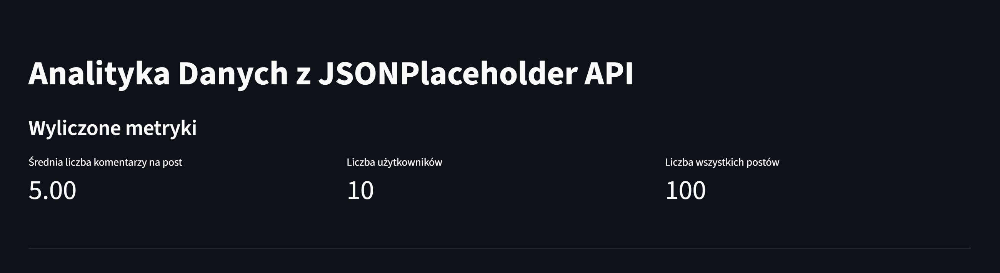

# API Analytics

Prosta aplikacja analityczna oparta na danych z publicznego API:
https://jsonplaceholder.typicode.com

## Funkcjonalności

- Pobieranie danych z endpointów:
  - /users
  - /posts
  - /comments
  - /todos
- Wyliczone metryki:
  - Liczba postów na użytkownika
  - Średnia liczba komentarzy na post
  - Procent wykonanych TODO
  - Top 5 najbardziej komentowanych postów
- Wizualizacje:
  - Wykres słupkowy (aktywność użytkowników)
  - Wykres kołowy (procent wykonanych zadań)

## Technologie

- Python
- Streamlit
- Pandas
- Matplotlib

## Jak uruchomić

pip install -r requirements.txt  
streamlit run app.py

## Użycie AI

ChatGPT został użyty do:
- optymalizacji i poprawy czytelności
- przygotowania README